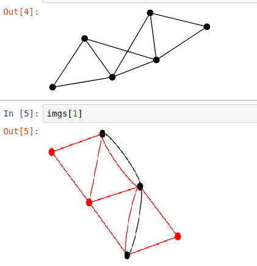

##### Please cite this paper if you want to develop something based on this repository in your publications

The Reinforcement Learning implementation of this project is forked from [https://github.com/ikostrikov/pytorch-a2c-ppo-acktr](https://github.com/ikostrikov/pytorch-a2c-ppo-acktr). The two projects listed below are help to study RL.

https://github.com/openai/gym/wiki/Table-of-environments

https://github.com/openai/baselines-results/blob/master/acktr_ppo_acer_a2c_atari.ipynb


#### 1. Parameters
在如下的参数设置中，ksp.sh得到的阻塞率在10%左右，一轮游戏的最终得分为5000分左右。
```bash
--net 6node.md --wave-num 10 --rou 8 --miu 300 --max-iter 300 \
--k 1 --weight None --workers 4 --steps 2700
```

#### 2. reward


> 这种奖惩机制的结果不理想，因此做了更改。相关结果可见`results/before20180306`
见Service.py。
> 必须保证ARRIVAL_OP_OT的值和其他reward值不一样
> 这个失败的实现代码的tag是v0.1。没有将路由信息的k个channel放进去。

>|state|变量名（Service.py）|action|reward|
|:----|:-----|:-----|:-----|
|该时间点没有业务到达，可能有业务离去（取决于事件排序）| NOARRIVAL_NO|No-Action|1|
|该时间点没有业务到达，可能有业务离去（取决于事件排序）| NOARRIVAL_OT|选择其他RW选项|0|
|该时间点有业务到达（可能同时有业务离去），但是没有可达RW选项|ARRIVAL_NOOP_NO|No-Action|1|
|该时间点有业务到达（可能同时有业务离去），但是没有可达RW选项|ARRIVAL_NOOP_OT|选择其他RW选项|0|
|该时间点有业务到达（可能同时有业务离去），并且有可达RW选项|ARRIVAL_OP_OT|选择可达RW选项|10|
|该时间点有业务到达（可能同时有业务离去），并且有可达RW选项|ARRIVAL_OP_NO|选择不可达RW或者No-Action|-5|


**上述是之前做的一次尝试，结果非常不好，因此做了得分调整。引入了参数控制：**

|state|变量名（Service.py）|action|reward|
|:----|:-----|:-----|:-----|
|该时间点没有业务到达，可能有业务离去（取决于事件排序）| NOARRIVAL_NO|No-Action|1|
|该时间点没有业务到达，可能有业务离去（取决于事件排序）| NOARRIVAL_OT|选择其他RW选项|-1|
|该时间点有业务到达（可能同时有业务离去），但是没有可达RW选项|ARRIVAL_NOOP_NO|No-Action|args.punish|
|该时间点有业务到达（可能同时有业务离去），但是没有可达RW选项|ARRIVAL_NOOP_OT|选择其他RW选项|args.punish|
|该时间点有业务到达（可能同时有业务离去），并且有可达RW选项|ARRIVAL_OP_OT|选择可达RW选项|args.reward|
|该时间点有业务到达（可能同时有业务离去），并且有可达RW选项|ARRIVAL_OP_NO|选择不可达RW或者No-Action|args.punish|


####  3. 情况处理

1. 某时间点有一个业务到达和一条及以上业务离去，则根据事件排序结果，
先处理排在到达业务之前的离去业务，然后返回到达业务的observation
2. 某时间点只有业务离去，则直接进行业务离去处理，然后返回业务离去
之后的observation
3. 如果执行完某个行为以后，返回done=True，即本轮游戏结束。则自动reset()，重新开启一局
游戏，并且返回本次游戏的obs, reward，和done=True同时返回。由于done的作用仅仅是计算
return和reward，所以一次的误差不会带来什么影响。
4. 转成np.ndarray类型的图像CHW矩阵的时候，做了灰度图的归一化处理。
5. 如果处理的到达业务是最后一个到达业务的话，则本游戏直接结束。因为后续只能是业务释放
6. 默认将路由信息也作为k个channel放进去了，相关方法可见draw.py文件。


#### 4. 优化想法（未完成的事情）

1. 把实时算出来的路由图像也加进去算作一个channel
2. 可以考虑把路由图像部分作为网络另一支路。
3. 现在是按照时间线一步一步前进，这样导致batch样本里面真正可用的只占`1.0/args.rou`，
是否应该修改成每一步都会直接推进到下一个业务到来的时刻？
> 已经实现了。增加了--step-over的选项，one_time表示按照时间序列推进，one_service表示
按照事件序列推进。
4. 增加模型验证的程序，其中注意act方法中的deterministic的取值，应该为True吧。
5. visdom可视化
6. 多机多卡的加速
7. 用FC网络进行横向结果对比
8. 学习率调整
9. 把模型封装进gym，可以利用gym自带的API进行可视化
10. on-policy和off-policy算法增加进去（ppo，acktr）
11. 如何实现路径计算
12. **核心问题** ：如果上述结果比较理想的话，下一步要面临的直接问题就是40,80,362乃至更多channels的分配问题
13. 将5wave组合成10wave，小模型组合大模型
14. 尽快实现更加robust的算法，比如PPO，ACKTR以及LSTM扩展

#### 5. 分析与验证

1. 1channel_access_check 证明了GRWA具有判断网络可达性的能力
2. RL的action space，不同源宿下对应的路由是不一样的，这种隐性的逻辑尚未验证深度学习能否掌握
3. 学习得到的模型是否具备学习路由算法的能力，需要去探索以前的神经网络在这方面的应用。
4. 得到在指定rou/miu情况下，指定wave_num的指定光网络模型对应的网络结构以后，需要探究以下几个方面的问题：
    1. 该结构对于不同的rou/miu情况，是否仍然work
    2. 该结构是否可以作为更多wave_num的更大模型的pretrain，或者是teacher网络，以降低更大光网络模型训练所需要的时间
    3. 该结构是否考虑到时序，不同的num_steps下结果会有什么不一样，与LSTM的对比呢？
5. 


#### 6. 对比实验

1. 使用FC网络，对最小网络表达进行学习。需要对step函数进行修改
2. 增加ksp中计算出来的路由图像的channels，以此来明确给出路由信息。
3. 能否直接输出网络路由，利用object detection或者landmark的相关技术。


---
---
#### 7. 踩过的坑

1. numpy中的布尔类型默认是numpy.bool_，这种类型不能使用“is True”这样的语句来判断真值。
要使用bool()做类型转换。
2. np.random.randint太坑了，使用Process多进程同时启动生成的随机数完全一样，搞得我还以为
是所有的进程共享一个游戏内存呢。改成了random模块的randint
3. 使用graphviz生成图像然后用PIL.Image读入进行处理的方式，有以下两个弊端，目前并没有
比较可行的解决方案：
    1. 磁盘频繁读写造成效率低下，并且对磁盘的损伤比较大，很容易出现错误
    2. 不同帧图像覆盖的是同名文件，可能会出现图像文件还没有刷新好，就已经被读入的错误
> 作者已经回复了，详情可见：https://github.com/xflr6/graphviz/issues/49#issuecomment-370132248
> 现在直接在内存中做转换，已经在RwaNet.py中实现了。
4. 使用graphviz生成的拓扑图像，在neato布局方式下，有可能会不一样，如下图所示。而且我在生成图像
的时候，并没有给节点做标记，这可能是目前训练不成功的重要原因之一。



5. 必须将模型设置为eval模式，才能够正确进行模型效果评估。因为我都是用了BN。
6. 在写网络拓扑的md的时候，不要加空格，否则会读到带空格的节点名称，导致无法匹配
7. 在解析节点的时候，不要用.startswith方法，因为节点数大于10的拓扑，会出现多匹配的情况
9. argparse在解析bool参数的时候，只要该参数在脚本中存在，则无论指定False或者True，都判定为True

#### 8. 基础模型

该工程的实现源自于[ikostrikov](https://github.com/ikostrikov/pytorch-a2c-ppo-acktr)
共享的利用pytorch实现A2C、PPO、ACKTR算法的工程，我fork到
[自己的仓库](https://github.com/BoyuanYan/pytorch-a2c-ppo-acktr)中，加入了一些测试结果
等等辅助理解的内容。

##### PongNoFrameskip-v4

模型有效性的判断是通过**PongNoFrameskip-v4**这个游戏进行评估的。
该游戏大体是玩乒乓球，在gym中没有找到名字对应的游戏，但是应该是 https://gym.openai.com/envs/Pong-v0/
 里面提到的那样。

| 参数名 | 参数取值 | 注释 |
|:------|:-------|:-----|
|action space| Discrete(6) | 每隔k帧进行一次action选择，k为{2,3,4}的均匀分布|
|observation space| Box(210, 160, 3)|HWC模式|
|reward range | (-inf, inf) ||
