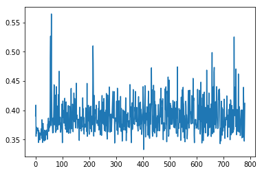
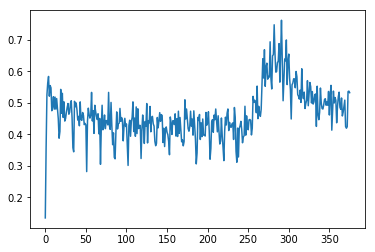
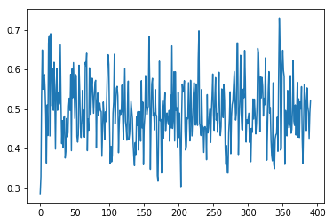
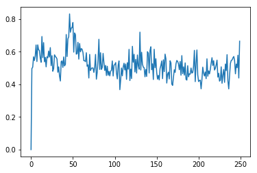
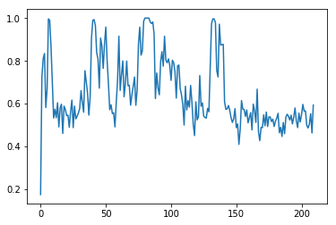
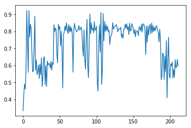

奖惩机制如下：


|state|变量名（Service.py）|action|reward|
|:----|:-----|:-----|:-----|
|该时间点没有业务到达，可能有业务离去（取决于事件排序）| NOARRIVAL_NO|No-Action|1|
|该时间点没有业务到达，可能有业务离去（取决于事件排序）| NOARRIVAL_OT|选择其他RW选项|0|
|该时间点有业务到达（可能同时有业务离去），但是没有可达RW选项|ARRIVAL_NOOP_NO|No-Action|1|
|该时间点有业务到达（可能同时有业务离去），但是没有可达RW选项|ARRIVAL_NOOP_OT|选择其他RW选项|0|
|该时间点有业务到达（可能同时有业务离去），并且有可达RW选项|ARRIVAL_OP_OT|选择可达RW选项|10|
|该时间点有业务到达（可能同时有业务离去），并且有可达RW选项|ARRIVAL_OP_NO|选择不可达RW或者No-Action|-5|


---

## <p align="center">test_5wave</p>

####
```bash
#!/usr/bin/env sh
# 测试5个波长情况下的表现

python -u ../main.py --mode learning --cnn simplestnet --num-steps 16 --step-over one_service \
--net 6node.md --wave-num 5 --rou 8 --miu 120 --max-iter 1000 \
--k 1 --weight None --workers 16 --steps 10e6 \
--img-height 224 --img-width 224
```



## <p align="center">log-cuda-a2c-simplestnet-89549</p>

```bash
#!/usr/bin/env sh


#SBATCH --partition=Liveness
#SBATCH --gres=gpu:1
#SBATCH --ntasks-per-node=1
#SBATCH -n1
#SBATCH --job-name=a2c
#SBATCH -o log-cuda-a2c-simplestnet-%j
#SBATCH -w BJ-IDC1-10-10-16-82

srun python -u ../main.py --mode learning --cnn simplestnet --num-steps 16 --cuda True \
--net 6node.md --wave-num 10 --rou 8 --miu 300 --max-iter 300 \
--k 1 --weight None --workers 16 --steps 10e6 \
--img-height 224 --img-width 224

```




## <p align="center"> log-cuda-a2c-mobilenetv2-89533</p>

```bash
#!/usr/bin/env sh


#SBATCH --partition=Liveness
#SBATCH --gres=gpu:1
#SBATCH --ntasks-per-node=1
#SBATCH -n1
#SBATCH --job-name=a2c
#SBATCH -o log-cuda-a2c-mobilenetv2-%j
#SBATCH -w BJ-IDC1-10-10-16-81

srun python -u ../main.py --mode learning --cnn mobilenetv2 --num-steps 8 --cuda True \
--net 6node.md --wave-num 10 --rou 8 --miu 300 --max-iter 300 \
--k 1 --weight None --workers 16 --steps 10e6 \
--img-height 224 --img-width 224

```



## <p align="center">log-cuda-a2c-simplenet-90189 </p>

```bash
#!/usr/bin/env sh


#SBATCH --partition=Liveness
#SBATCH --gres=gpu:1
#SBATCH --ntasks-per-node=1
#SBATCH -n1
#SBATCH --job-name=a2c
#SBATCH -o log-cuda-a2c-simplenet-%j
#SBATCH -w BJ-IDC1-10-10-16-82

srun python -u ../main.py --mode learning --cnn simplenet --num-steps 16 --cuda True \
--net 6node.md --wave-num 10 --rou 8 --miu 300 --max-iter 300 \
--k 1 --weight None --workers 16 --steps 10e6 \
--img-height 224 --img-width 224

```




## <p align="center">log-cuda-a2c-squeezenet-89539 </p>
```bash
#!/usr/bin/env sh


#SBATCH --partition=Liveness
#SBATCH --gres=gpu:1
#SBATCH --ntasks-per-node=1
#SBATCH -n1
#SBATCH --job-name=a2c
#SBATCH -o log-cuda-a2c-squeezenet-%j
#SBATCH -w BJ-IDC1-10-10-16-81

srun python -u ../main.py --mode learning --cnn squeezenet --num-steps 16 --cuda True \
--net 6node.md --wave-num 10 --rou 8 --miu 300 --max-iter 300 \
--k 1 --weight None --workers 16 --steps 10e6 \
--img-height 224 --img-width 224

```



## <p align="center"> log-cuda-a2c-alex-89532</p>

```bash
#!/usr/bin/env sh


#SBATCH --partition=Liveness
#SBATCH --gres=gpu:1
#SBATCH --ntasks-per-node=1
#SBATCH -n1
#SBATCH --job-name=a2c
#SBATCH -o log-cuda-a2c-alex-%j
#SBATCH -w BJ-IDC1-10-10-16-81

srun python -u ../main.py --mode learning --cnn alexnet --num-steps 16 --cuda True \
--net 6node.md --wave-num 10 --rou 8 --miu 300 --max-iter 300 \
--k 1 --weight None --workers 16 --steps 10e6 \
--img-height 224 --img-width 224

```


